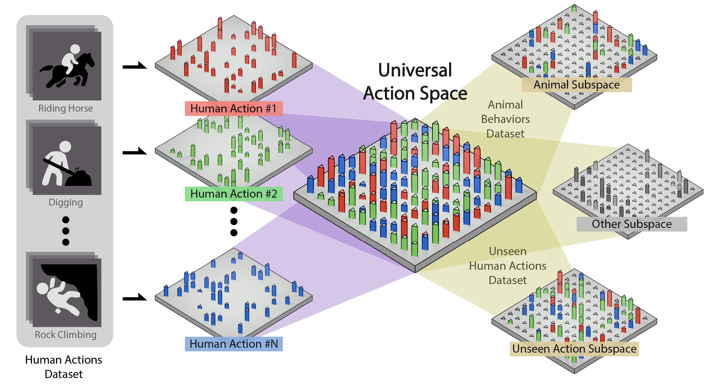

# Universal Action Space

---

This repo is the official implementation of [A Universal Action Space for General Behavior Analysis](#TODO). It is based on [Video Swin Transformer](https://github.com/SwinTransformer/Video-Swin-Transformer).



## Results

### MammalNet & ChimpBehave

| Dataset | Backbone | Pretrain | Training Strategy | Top-1 Accuracy | Mean Class Accuracy | Training Time (hr) | #Params (K) | config |
| :---: | :---: | :---: | :---: | :---: | :---: | :---: | :---: | :---: |
| [MammalNet](https://mammal-net.github.io/) | Swin-B | [Kinetics-400](https://github.com/SwinTransformer/storage/releases/download/v1.0.4/swin_base_patch244_window877_kinetics400_22k.pth) | Linear Probing | 56.6 | 43.2 | 8.3 | 12.3 | [config](configs/recognition/swin/swin_base_patch244_window877_mammalnet_k400.py) |
| [ChimpBehave](https://github.com/MitchFuchs/ChimpBehave) | Swin-B | [Kinetics-400](https://github.com/SwinTransformer/storage/releases/download/v1.0.4/swin_base_patch244_window877_kinetics400_22k.pth) | Linear Probing | 93.7 | 65.8 | 3.9 | 7.2 | [config](configs/recognition/swin/swin_base_patch244_window877_chimpBehave_k400.py) |
| [ChimpBehave](https://github.com/MitchFuchs/ChimpBehave) | Swin-B | [Kinetics-600](https://github.com/SwinTransformer/storage/releases/download/v1.0.4/swin_base_patch244_window877_kinetics600_22k.pth) | Linear Probing | 93.5 | 72.3 | 3.9 | 7.2 | [config](configs/recognition/swin/swin_base_patch244_window877_chimpBehave_k600.py) |
| [ChimpBehave](https://github.com/MitchFuchs/ChimpBehave) | Swin-B | [Kinetics-700](https://github.com/franktpmvu/Universal-Action-Space/releases/download/Pre-train/swin_base_patch244_window877_kinetics700_22k.pth) | Linear Probing | 94.2 | 56.4 | 3.9 | 7.2 | [config](configs/recognition/swin/swin_base_patch244_window877_chimpBehave_k700.py) |

### Kinetics-700 diff
| Dataset | Backbone | Pretrain | Training Strategy | Top-1 Accuracy | Top-5 Accuracy | Mean Class Accuracy | Training Time (hr) | #Params (K) | config |
| :---: | :---: | :---: | :---: | :---: | :---: | :---: | :---: | :---: | :---: |
| [Kinetics-700](https://github.com/cvdfoundation/kinetics-dataset) diff | Swin-B | [Kinetics-600](https://github.com/SwinTransformer/storage/releases/download/v1.0.4/swin_base_patch244_window877_kinetics600_22k.pth) | Full Fine-tuning | **88.8** | 98.0 | **88.8** | 105 | 87,744.66 | - |
| [Kinetics-700](https://github.com/cvdfoundation/kinetics-dataset) diff | Swin-B | [Kinetics-600](https://github.com/SwinTransformer/storage/releases/download/v1.0.4/swin_base_patch244_window877_kinetics600_22k.pth) | LoRA | 88.6 | **98.1** | 88.6 | 86 | 1,645.7 | [config](configs/recognition/swin/swin_base_patch244_window877_kinetics700_diff_k600_lora.py) |
| [Kinetics-700](https://github.com/cvdfoundation/kinetics-dataset) diff | Swin-B | [Kinetics-600](https://github.com/SwinTransformer/storage/releases/download/v1.0.4/swin_base_patch244_window877_kinetics600_22k.pth) | Linear Probing | 89.7 | 97.8 | 87.8 | **54** | **105.6** | [config](configs/recognition/swin/swin_base_patch244_window877_kinetics700_diff_k600.py) |

---

## Usage
### Installation
Please refer to [install.md](docs/install.md) for install Video Swin Transformer.

### Data Preparation
Please refer to [data_preparation.md](docs/data_preparation.md) for a general knowledge of data preparation for Video Swin Transformer.

#### Datatsets
We use the following datasets in our paper:
  - [MammalNet](https://mammal-net.github.io/): 173 mammalian species with 12 behavior classes
  - [ChimpBehave](https://github.com/MitchFuchs/ChimpBehave): 7 chimpanzee behavior classes, we also provide our split lists ([train](https://github.com/franktpmvu/Universal-Action-Space/releases/download/Pre-release/chimpbehave_train.txt), [val](https://github.com/franktpmvu/Universal-Action-Space/releases/download/Pre-release/chimpbehave_val.txt))
  - [Kinetics](https://github.com/cvdfoundation/kinetics-dataset): 400/600/700 human actions

#### Kinetics-700 diff set
**Kinetics-700 diff set** is the set of 103 action classes that are present in Kinetics-700 but not in Kinetics-600.
You can download the Kinetics-700 dataset and use our provided lists ([train](https://github.com/franktpmvu/Universal-Action-Space/releases/download/Pre-release/k700_diff_train.txt), [val](https://github.com/franktpmvu/Universal-Action-Space/releases/download/Pre-release/k700_diff_val.txt)) directly.

---

### Training
```
python tools/train.py configs/recognition/swin/swin_base_patch244_window877_chimpBehave_k400.py --work-dir ./work_dirs/chimpBehave_k400 --cfg-options freeze_backbone=True load_from=checkpoints/swin_base_patch244_window877_kinetics400_22k.pth
```

`--work-dir` specifies the output directory
`--cfg-options` is used to modify configuration options:
  - freeze_backbone: (boolean) freezes the parameters of all layers except the head
  - load_from: (string) loads a pretrained checkpoint

#### LoRA:
```
python tools/train.py swin_base_patch244_window877_kinetics700_diff_k600_lora.py --work-dir ./work_dirs/kinetics700_diff_lora --cfg-options freeze_backbone=True load_from=checkpoints/swin_base_patch244_window877_kinetics400_22k.pth model.backbone.use_lora=True model.backbone.lora_rank=32 model.backbone.lora_alpha=32
```

Add LoRA options after `--cfg-options` to modify LoRA settings:
- model.backbone.use_lora: (boolean) use LoRA or not
- model.backbone.lora_rank: (integer) LoRA Rank
- model.backbone.lora_alpha: (integer) LoRA Alpha

Note: You can also use LoRA options with standard configuration files; it is not necessary to use a dedicated `_lora` configuration files.

---

### Validation
```
python tools/test.py configs/recognition/swin/swin_base_patch244_window877_chimpBehave_k400.py work_dirs/chimpBehave_k400/epoch_30.pth --eval top_k_accuracy mean_class_accuracy
```

`--eval` options:
  - top_k_accuracy
  - mean_class_accuracy
  - mean_average_precision
  ⋮

